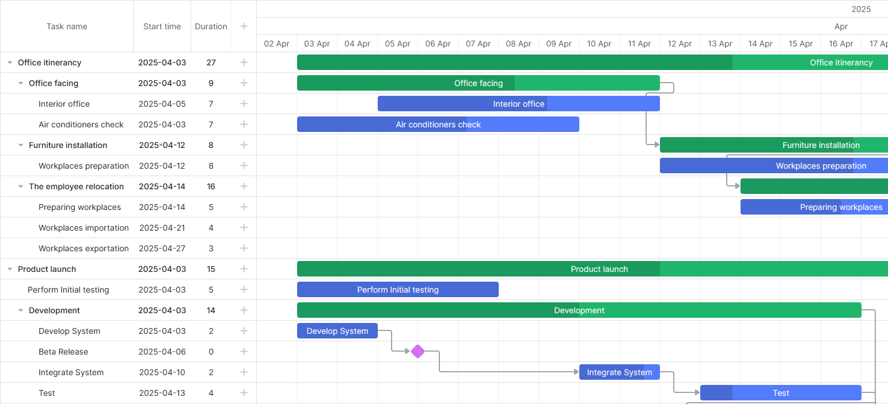

# React Scheduler Quick-Start

[](https://dhtmlx.com/)

> Starter project showing how to use [DHTMLX React Scheduler](https://dhtmlx.com/docs/products/dhtmlxScheduler-for-React/) in a React App.




## How to start

### Online

[](https://codespaces.new/DHTMLX/react-scheduler-quick-start/) 

### On the local host 

**Note**, `@dhx/react-scheduler` and `@dhx/trial-react-scheduler` are hosted on a private Npm registry. You need to configure your npm client and request access to them.

1. [Start a trial](https://dhtmlx.com/docs/products/dhtmlxScheduler/download.shtml) to gain access to **@dhx** npm registry and follow the provided instructions for npm configuration.

2. Clone the repo and run 

```bash
git clone https://github.com/dhtmlx/react-scheduler-quick-start.git
cd react-scheduler-quick-start
yarn
yarn start
```

## Code example

The component allows simple declarative initialization:

```ts
import { useRef } from 'react';
import ReactScheduler, { ReactSchedulerRef, Event, SchedulerTemplates, SchedulerConfig } from '@dhx/trial-react-scheduler';
import "@dhx/trial-react-gantt/dist/react-scheduler.css";

export interface ReactSchedulerProps {
  events: Event[];
  activeView?: string;
  activeDate?: Date;
}

export default function GanttChart({ events, activeView, activeDate }: ReactSchedulerProps) {
  const schedulerRef = useRef<ReactSchedulerRef>(null);

  const templates: SchedulerTemplates = {
    event_class: (start: Date, end: Date, event: Event) => {
      return event.classname || '';
    }
  };

  const config: SchedulerConfig = {
    first_hour: 6,
    last_hour: 22,
    hour_size_px: 60,
  };

  return (
    <ReactScheduler
      ref={schedulerRef}
      events={events}
      view={activeView}
      date={activeDate}
      templates={templates}
      config={config}
      data={{
        save: (entity: string, action: string, data: any, id: string | number) => {
          console.log(`${entity} - ${action} - ${id}`, data);;
        }
      }}
    />
  );
```

Check the [Online documentation](https://docs.dhtmlx.com/scheduler/web__react.html) to find more.

## Project structure

```
src/
  components/Scheduler
    Scheduler.tsx  <- <ReactScheduler /> component
    styles.css  <- custom styles for colored events
  demoData.ts  <- minimal events array
  App.tsx      <- mounts Scheduler
  main.tsx
public/
  index.html
```

## Want full-featured examples?

[Start your 30-day trial](https://dhtmlx.com/docs/products/dhtmlxScheduler/download.shtml) to download the complete sample pack (auto-scheduling, resource histogram, Redux integration, etc.).

## License 

The code in this repository is released under the **MIT** License.

`@dhx/react-scheduler` and `@dhx/trial-react-scheduler` are commercial libraries - use them under a valid license or evaluation agreement.

## Useful links


- [Learn about DHTMLX React Scheduler](https://dhtmlx.com/docs/products/dhtmlxScheduler-for-React/)
- [Learn about DHTMLX Scheduler](https://dhtmlx.com/docs/products/dhtmlxScheduler/)
- [Technical support](https://forum.dhtmlx.com/c/scheduler)
- [Online documentation](https://docs.dhtmlx.com/scheduler/react.html)